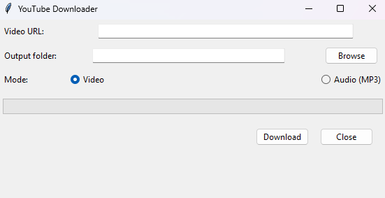

# YouTube Downloader 🎥⬇️

A simple yet powerful desktop application to download **YouTube videos or audio** with a user-friendly **Tkinter GUI**.  
Built in **Python 3**, it leverages [`yt-dlp`](https://github.com/yt-dlp/yt-dlp) for reliable downloads and includes a progress bar with status updates.  

---

## 📷 Screenshots

### Main Window


---

## ✨ Features
- 🎬 Download **videos** in the best available quality  
- 🎵 Extract and save **audio only (MP3)**  
- 📂 Choose custom **output folder**  
- 📊 **Progress bar** showing download status  
- ✅ Error handling with clear messages  
- 💻 GUI built with **Tkinter** (native, cross-platform)  

---

## 🛠️ Tech Stack
- **Python 3.10+**  
- [yt-dlp](https://github.com/yt-dlp/yt-dlp) — video/audio downloading  
- **Tkinter** — graphical user interface  
- [FFmpeg](https://ffmpeg.org/) — required for audio extraction (MP3)  

---

## 📦 Installation
Clone the repository and create a virtual environment:

```bash
git clone https://github.com/YOUR_USERNAME/Youtube_Download.git
cd Youtube_Download

python -m venv .venv
# Activate the environment:
# Linux/Mac
source .venv/bin/activate
# Windows
.\.venv\Scripts\activate

pip install -r requirements.txt
```
---

🚀 Usage

1. Paste the YouTube URL
2. Choose the output folder
3. Select Video or Audio (MP3)
4. Click Download and watch the progress bar

---

📄 License

This project is released under the MIT License

---

👨‍💻 Author

Developed by Marcos Vinicius Thibes Kemer

---